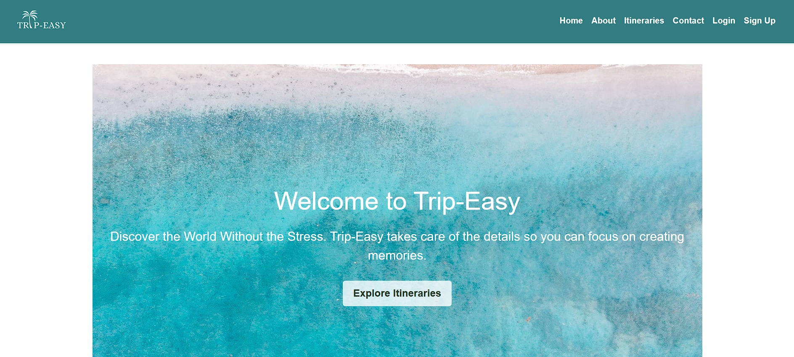
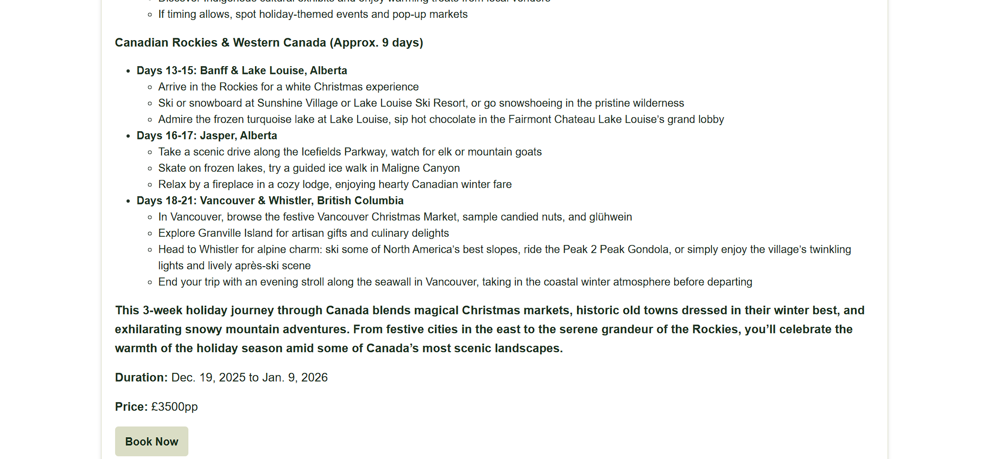
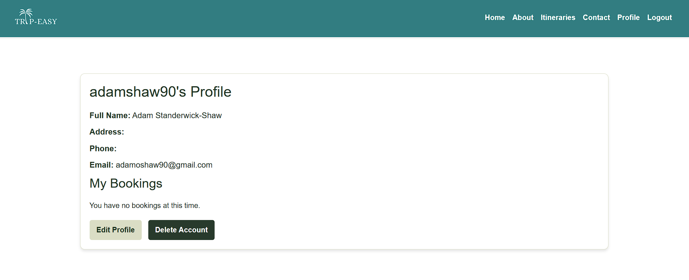
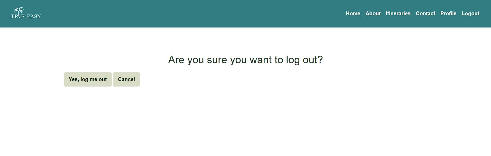
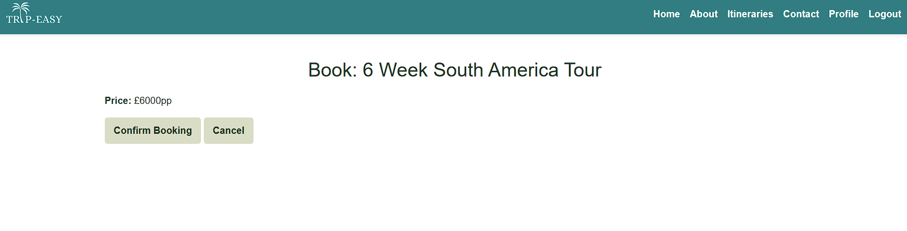
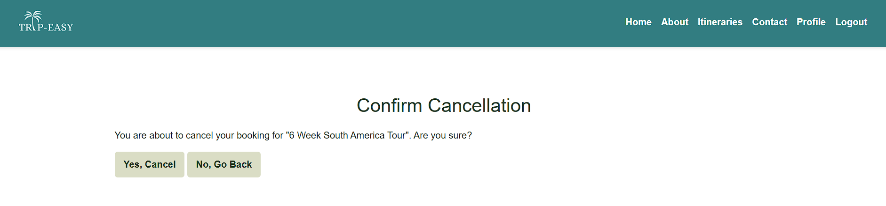

# Trip-Easy


Trip-Easy is a fully functioning web application for a travel agent. The site provides users with information about pre-made holiday itineraries, and allows users to easily create personal accounts and profiles, a holiday booking system and a reviews section. The site also enables administrators to post new itineraries to the site, as well as view and make changes to bookings on behalf of users.

## UX

The design philosophy was to create a simple, colourful yet minimalistic look, in contrast to the over-exaggerated and messy websites that are usually portrayed for the travel industry. The website easliy flows and the website is designed for ease of use and so the user cannot get lost or stuck.

### Colour Scheme


The color scheme uses an inviting blue and off-white colour scheme to put the eyes and mind at ease when browsing the site.


## User Stories

All user stories can be found in a linked GitHub project [here](https://github.com/users/adamshaw90/projects/6)


## Features

## Existing Features

### Site Pages

- **Homepage**

    - The main homepage for the site. Hero image is large and striking. Welcome message to let users know what the site is. Call to action button to invite users to enter and explore the site.




- **About Page**

    - About page. Gives users essential information about the travel agent and their values. Text content accompanied by relevant images helps keep the user engaged and understand the message presented.


- **Itineraries Page**

    - Itineraries Page. Displays a selection of itineraries for the user to choose. Once an itinerary is selected, the user can go on to view a detailed description and access the reviews section.




- **Contact Page**

    - Contact Page. Users can see contact information for Trip-Easy, including 
    a contact email address and location information. An embedded Google Maps widget allows users to see the business's exact location. There is also a form that can be filled out by users.


- **Sign-up Page**

    - Sign-up Page. Displays a form that new users of the site can fill in and make an account. The form is short, simple, and clean to encourage users to use it.


- **Login Page**

    - Login Page. Displays a login form that existing users can use to log in to the site. Two simple input fields for username and password make it easy for users to log in to their account. A Forgot Password link takes users to another page where they can recover their password.


- **Profile Page**

    - Profile page. Displays a user's profile information. Lets a user see their relevant profile information in a clean and simple way, and contains an edit form that users can use to update their profile information. It also displays any current bookings they have.




- **Logout Page**

    - Logout Page. A simple page confirming that the user has logged out of their account. Displays a log in again button in case the user wishes to log back in.


- **Delete Account Page**

    - Delete Account Page. A simple page confirming that the user wants to delete their account.


- **Custom Error Page**

    - Custom error handler page. This displays a simple error page that lets the user know that there has been an error loading the url with a button to take them back to the home-page of the site.


### User Features

- **User Registration**

    - Users can register for an account using a front-end form. This creates a user object in the database and automatically secures the user's sensitive information.


- **User Login**

    - Users who have made an account can quickly and easily log in to their account in order to access the login-required functionality of the site.


- **User Logout**

    - Users who are logged in can easily log out in order to stop access to their account-based information and functionality.




- **Login Dependant Navbar Links**

    - Users who are logged in see new links in the navbar. 'Sign Up' and 'Login' links are replaced with 'Profile' and 'Logout' links. This provides the user with visual feedback upon logging in, as well as removing links that they will not need.


- **User Profile Creation**

    - User profiles are automatically created upon user registration. This assigns each user a profile which they can use to see/update their user information.


- **User Profile Update**

    - Users can update their profile information using a front-end form located on their user profile page. This allows users to update profile information or correct possible mistakes made at registration.


- **User Itinerary Booking**

    - Users can use the button on a given itinerary page to book the itinerary - followed by a confirmation.




    This booking will then show in the user profile page.


- **User Itinerary Booking Cancellation**

    - Users can cancel their existing booking using front-end functionality on the site, without having to call or visit the tennis club. On the profile page there is clear and obvious 'cancel' button located on the booking, which will take them to a confirmation page, before deleteing their booking.




### Future Features


- Update Bookings
    - A user can edit their booking, without deleting it and creating a new one.
- Advanced reservation actions for admins.
- Online Payment System.
    - Users can pay the cost of their itinerary booking online.
- Advanced itinerary actions for admins.
    - Front end itinerary creation.
    - Front end edit and delete functions.


## Tools & Technologies Used


- [HTML](https://en.wikipedia.org/wiki/HTML) used for the main site content.
- [CSS](https://en.wikipedia.org/wiki/CSS) used for the main site design and layout.
- [CSS Flexbox](https://www.w3schools.com/css/css3_flexbox.asp) used for an enhanced responsive layout.
- [CSS Grid](https://www.w3schools.com/css/css_grid.asp) used for an enhanced responsive layout.
- [JavaScript](https://www.javascript.com) used for user interaction on the site.
- [Python](https://www.python.org) used as the back-end programming language.
- [Git](https://git-scm.com) used for version control. (`git add`, `git commit`, `git push`)
- [GitHub](https://github.com) used for secure online code storage.
- [Gitpod](https://gitpod.io) used as a cloud-based IDE for development.
- [Bootstrap](https://getbootstrap.com) used as the front-end CSS framework for modern responsiveness and pre-built components.
- [Django](https://www.djangoproject.com) used as the Python framework for the site.
- [PostgreSQL](https://www.postgresql.org) used as the relational database management.
- [CodeInstitute Database](https://dbs.ci-dbs.net/) used as the Postgres database.
- [Heroku](https://www.heroku.com) used for hosting the deployed site.
- [Cloudinary](https://cloudinary.com) used for online static file storage.
- [Cloud Convert](https://cloudconvert.com/webp-to-png) used for image processing.
- [Gunicorn](https://gunicorn.org/) used for WSGI server.
- [sycopg2](https://pypi.org/project/psycopg2/) used as a PostgreSQL database adapter.
- [AmIResponsive](https://ui.dev/amiresponsive) used as a mock-up maker.

## Database Design

While planning this project, I drew up some Entity Relationship Diagrams to help me to visualise the database models and their relationships. 


## Agile Development Process

### GitHub Projects & Issues
GitHub projects served as an Agile tool for this project.
It isn't a specialized tool, but it can be used the same way.

Through it, user stories, issues, and tasks were planned, then tracked on a weekly basis using the basic Kanban board.


## Testing

For all testing, please refer to the [TESTING.md](TESTING.md) file.

## Deployment

The live deployed application can be found deployed on [Heroku](https://trip-easy-d2ed1842c9a5.herokuapp.com/).


### Cloudinary API

This project uses the [Cloudinary API](https://cloudinary.com) to store media assets online, due to the fact that Heroku doesn't persist this type of data.

To obtain your own Cloudinary API key, create an account and log in.
- For *Primary interest*, you can choose *Programmable Media for image and video API*.
- Optional: *edit your assigned cloud name to something more memorable*.
- On your Cloudinary Dashboard, you can copy your **API Environment Variable**.
- Be sure to remove the `CLOUDINARY_URL=` as part of the API **value**; this is the **key**.

### Heroku Deployment

This project uses [Heroku](https://www.heroku.com), a platform as a service (PaaS) that enables developers to build, run, and operate applications entirely in the cloud.

Deployment steps are as follows, after account setup:

- Select **New** in the top-right corner of your Heroku Dashboard, and select **Create new app** from the dropdown menu.
- Your app name must be unique, and then choose a region closest to you (EU or USA), and finally, select **Create App**.
- From the new app **Settings**, click **Reveal Config Vars**, and set your environment variables.

| Key | Value |
| --- | --- |
| `CLOUDINARY_URL` | user's own value |
| `DATABASE_URL` | user's own value |
| `DISABLE_COLLECTSTATIC` | 1 (*this is temporary, and can be removed for the final deployment*) |
| `SECRET_KEY` | user's own value |

Heroku needs two additional files in order to deploy properly.
- requirements.txt
- Procfile

You can install this project's **requirements** (where applicable) using:
- `pip3 install -r requirements.txt`

If you have your own packages that have been installed, then the requirements file needs updated using:
- `pip3 freeze --local > requirements.txt`

The **Procfile** can be created with the following command:
- `echo web: gunicorn app_name.wsgi > Procfile`
- *replace **app_name** with the name of your primary Django app name; the folder where settings.py is located*

For Heroku deployment, follow these steps to connect your own GitHub repository to the newly created app:

Either:
- Select **Automatic Deployment** from the Heroku app.

Or:
- In the Terminal/CLI, connect to Heroku using this command: `heroku login -i`
- Set the remote for Heroku: `heroku git:remote -a app_name` (replace *app_name* with your app name)
- After performing the standard Git `add`, `commit`, and `push` to GitHub, you can now type:
	- `git push heroku main`

The project should now be connected and deployed to Heroku!

### Local Deployment

This project can be cloned or forked in order to make a local copy on your own system.

For either method, you will need to install any applicable packages found within the *requirements.txt* file.
- `pip3 install -r requirements.txt`.

You will need to create a new file called `env.py` at the root-level,
and include the same environment variables listed above from the Heroku deployment steps.

Sample `env.py` file:

```python
import os

os.environ.setdefault("CLOUDINARY_URL", "user's own value")
os.environ.setdefault("DATABASE_URL", "user's own value")
os.environ.setdefault("SECRET_KEY", "user's own value")

# local environment only (do not include these in production/deployment!)
os.environ.setdefault("DEBUG", "True")
```

Once the project is cloned or forked, in order to run it locally, you'll need to follow these steps:
- Start the Django app: `python3 manage.py runserver`
- Stop the app once it's loaded: `CTRL+C` or `⌘+C` (Mac)
- Make any necessary migrations: `python3 manage.py makemigrations`
- Migrate the data to the database: `python3 manage.py migrate`
- Create a superuser: `python3 manage.py createsuperuser`
- Load fixtures (if applicable): `python3 manage.py loaddata file-name.json` (repeat for each file)
- Everything should be ready now, so run the Django app again: `python3 manage.py runserver`

#### Cloning

You can clone the repository by following these steps:

1. Go to the [GitHub repository](https://github.com/adamshaw90/Trip-easy)
2. Locate the Code button above the list of files and click it 
3. Select if you prefer to clone using HTTPS, SSH, or GitHub CLI and click the copy button to copy the URL to your clipboard
4. Open Git Bash or Terminal
5. Change the current working directory to the one where you want the cloned directory
6. In your IDE Terminal, type the following command to clone my repository:
	- `git clone https://github.com/adamshaw90/Trip-easy.git`
7. Press Enter to create your local clone.

Alternatively, if using Gitpod, you can click below to create your own workspace using this repository.

[](https://gitpod.io/#https://github.com/adamshaw90/Trip-easy)

Please note that in order to directly open the project in Gitpod, you need to have the browser extension installed.
A tutorial on how to do that can be found [here](https://www.gitpod.io/docs/configure/user-settings/browser-extension).

#### Forking

By forking the GitHub Repository, we make a copy of the original repository on our GitHub account to view and/or make changes without affecting the original owner's repository.
You can fork this repository by using the following steps:

1. Log in to GitHub and locate the [GitHub Repository](https://github.com/adamshaw90/Trip-easy)
2. At the top of the Repository (not top of page) just above the "Settings" Button on the menu, locate the "Fork" Button.
3. Once clicked, you should now have a copy of the original repository in your own GitHub account!

### Local VS Deployment

The local version, created on Gitpod, does not have the functionality to send confirmation emails. This is due to the fact that Gitpod blocks the necessary email port required to carry out this operation. Gitpod blocks this port by default due to concerns about email spam and it cannot be changed.

## Credits

### Media


| Source | Location | Type | Notes |
| --- | --- | --- | --- |
| [Pixabay](https://pixabay.com/vectors/palm-tree-landscape-silhouette-5257139/) | entire site | image | favicon on all pages
| [Pixabay](https://pixabay.com/photos/sea-beach-drone-vacations-summer-4768869/) | homepage | image | hero image |
| [Pixabay](https://pixabay.com/photos/road-highway-mount-cook-7199274/) | homepage, New Zealand itineraries pages | image | itinerary image
| [Pixabay](https://pixabay.com/photos/surfing-surfer-sea-surf-wave-3846850/) | homepage, Australia itineraries pages | image | itinerary image
| [Pixabay](https://pixabay.com/photos/cliff-of-moher-ireland-cliffs-coast-2371819/) | homepage, Ireland itineraries pages | image | itinerary image
| [Pixabay](https://pixabay.com/photos/italy-florence-church-tuscany-4256018/) | homepage, Italy itineraries pages | image | itinerary image
| [Pixabay](https://pixabay.com/photos/big-ben-westminster-london-england-1143631/) | homepage, Europe itineraries pages | image | itinerary image
| [Pixabay](https://pixabay.com/photos/taxi-nyc-new-york-city-1574278/) | homepage, USA itineraries pages | image | itinerary image
| [Pixabay](https://pixabay.com/photos/santorini-greece-buildings-houses-416136/) | homepage, Greece itineraries pages | image | itinerary image
| [Pixabay](https://pixabay.com/photos/mountains-animal-clouds-llama-6123127/) | homepage, South America itineraries pages | image | itinerary image
| [Pixabay](https://pixabay.com/photos/landscape-chalet-winter-house-4655698/) | homepage, Canada itineraries pages | image | itinerary image
| [Pixabay](https://pixabay.com/photos/rocks-beach-sea-ocean-sun-sunset-1239727/) | homepage, itineraries pages | image | default image if set image doesn't load
| [Pixabay](https://pixabay.com/photos/beach-people-running-ocean-sea-1836467/) | about page | image | our mission image
| [Pixabay](https://www.pexels.com/photo/a-woman-in-green-bikini-holding-a-book-8157356/) | about page | image | our vision image
| [Pixabay](https://www.pexels.com/photo/group-of-man-on-a-desert-667202/) | about page | image | our values image


### Acknowledgements

- I would like to thank my Code Institute cohort facilitator, Lewis Dillon for their support throughout the development of this project.
- I would like to thank the [Code Institute](https://codeinstitute.net) tutor team for their assistance with troubleshooting and debugging some project issues.
- I would like to thank the [Code Institute Slack community](https://code-institute-room.slack.com) and fellow students for the moral support.
- I would like to thank my wife Ottilie for putting up with my countless hours sat on my laptop whilst visiting various countries on a travelling vacation.