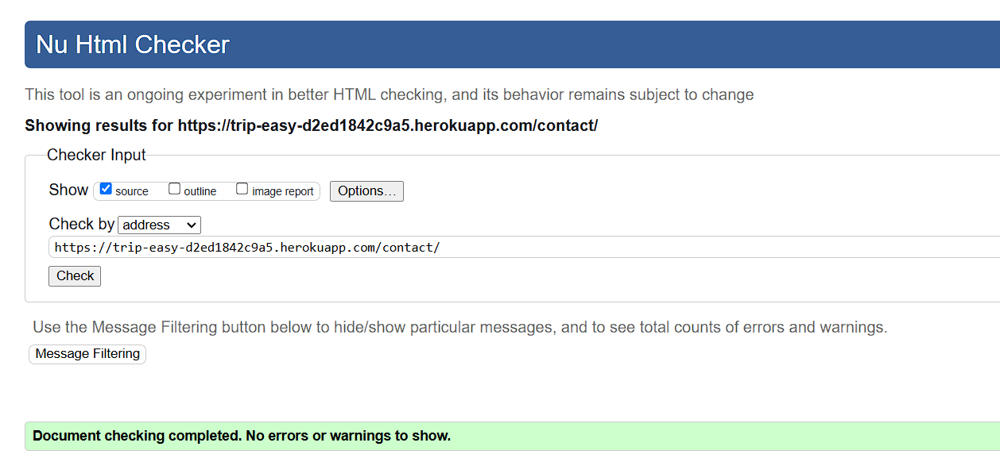
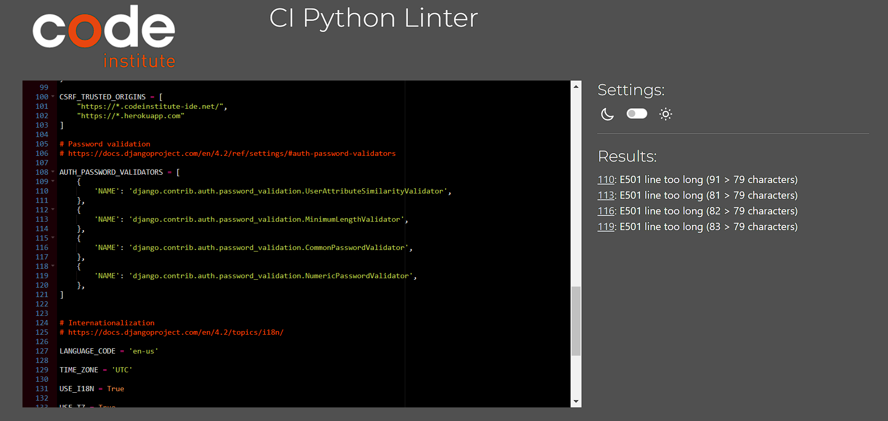
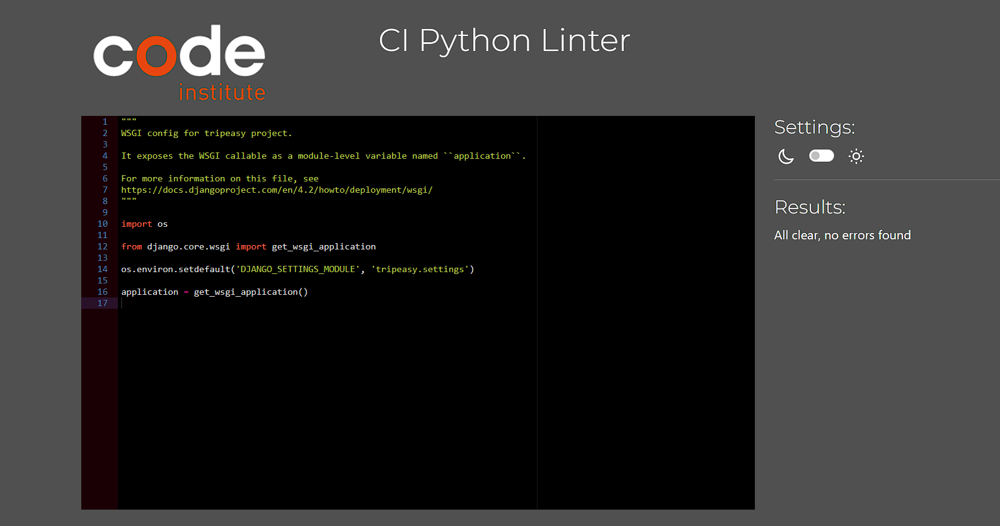

# Testing

Return back to the [README.md](README.md) file.

## Code Validation

### HTML

I have used the recommended [HTML W3C Validator](https://validator.w3.org) to validate all of my HTML files.

| Page | Screenshot | Notes |
| --- | --- | --- |
| 404 |  | Pass: No Errors, 1 Warning : HTML is compliant, external JS script warning. |
| About |  | Pass: No Errors |
| Base/Home |  | Pass: No Errors |
| Booking Form |  | Pass: No Errors, 1 Warning : HTML is compliant, external JS script warning. |
| Cancel Booking Confirmation |  | Pass: No Errors, 1 Warning : HTML is compliant, external JS script warning. |
| Delete Review Confirmation |  | Pass: No Errors, 1 Warning : HTML is compliant, external JS script warning. |
| Logout Confirmation |  | Pass: No Errors, 1 Warning : HTML is compliant, external JS script warning. |
| Contact |  | Pass: No Errors |
| Review Edit |  | Pass: No Errors, 1 Warning : HTML is compliant, external JS script warning. |
| Itinerary Cards |  | Pass: No Errors |
| Itinerary Delete Confirmation |  | Pass: No Errors, 1 Warning : HTML is compliant, external JS script warning. |
| Itinerary Details |  | Pass: No Errors |
| Login |  | Pass: No Errors |
| Delete Profile Confirmation |  | Pass: No Errors, 1 Warning : HTML is compliant, external JS script warning. |
| Edit Profile |  | Pass: No Errors, 1 Warning : HTML is compliant, external JS script warning. |
| Profile |  | Pass: No Errors, 1 Warning : HTML is compliant, external JS script warning. |
| Sign Up |  | Pass: No Errors |

### CSS

I have used the recommended [CSS Jigsaw Validator](https://jigsaw.w3.org/css-validator) to validate all of my CSS files.

| File | Screenshot | Notes |
| --- | --- | --- | --- |
| style.css |  | Pass: No Errors |

### JavaScript

I have used the recommended [JShint Validator](https://jshint.com) to validate all of my JS files.

| File | Screenshot | Notes |
| --- | --- | --- |
| modal-handler.js |  | Pass: No Errors - 1 'Undefined' message as bootstrap link is in the base.html file. |

### Python

I have used the recommended [PEP8 CI Python Linter](https://pep8ci.herokuapp.com) to validate all of my Python files.

#### Validation For Trip-Easy App
| File | Screenshot | Notes |
| --- | --- | --- |
| asgi.py |  | Pass: No Errors |
| settings.py |  | Pass: No Errors |
| urls.py |  | Pass: No Errors |
| wsgi.py |  | Pass: No Errors |

#### Validation For Booking App
| File | Screenshot | Notes |
| --- | --- | --- |
| admin.py |  | Pass: No Errors |
| apps.py |  | Pass: No Errors |
| forms.py |  | Pass: No Errors |
| models.py |  | Pass: No Errors |
| urls.py |  | Pass: No Errors |
| views.py |  | Pass: No Errors |

## Browser Compatibility

I've tested my deployed project on multiple browsers to check for compatibility issues.

| Browser | Screenshot | Notes |
| --- | --- | --- |
| Chrome |  | Works as expected |
| Firefox |  | Works as expected |
| Edge |  | Works as expected |

## Responsiveness

I've tested my deployed project on multiple devices to check for responsiveness issues.

| Device | Screenshot | Notes |
| --- | --- | --- |
| Mobile (DevTools) |  | Works as expected |
| Tablet (DevTools) |  | Works as expected |
| Desktop |  | Works as expected |

## Lighthouse Audit

I've tested my deployed project using the Lighthouse Audit tool to check for any major issues.

### Booking App Templates - Mobile Testing
| Page | Size | Screenshot | Notes |
| --- | --- | --- | --- |
| Home | Mobile |  | Some minor performance warnings |
| About | Mobile |  | Some minor performance warnings |
| Itineraries | Mobile |  | Warning about link text (ignored as link is a Bootstrap button) |
| Itinerary Detail | Mobile |  | Some minor performance warnings |
| Contact | Mobile |  | Some minor performance warnings |
| Profile | Mobile |  | Some minor performance warnings |
| Login | Mobile |  | Some minor performance warnings |
| Sign Up | Mobile |  | Some minor performance warnings |
| 404 | Mobile |  | Some minor performance warnings |

### Booking App Templates - Desktop Testing
| Page | Size | Screenshot | Notes |
| --- | --- | --- | --- |
| Home | Desktop |  | Some minor performance warnings |
| About | Desktop |  | Some minor performance warnings |
| Itineraries | Desktop |  | Warning about link text (ignored as link is a Bootstrap button) |
| Itinerary Detail | Desktop |  | Some minor performance warnings |
| Contact | Desktop |  | Some minor performance warnings |
| Profile | Desktop |  | Some minor performance warnings |
| Login | Desktop |  | Some minor performance warnings |
| Sign Up | Desktop |  | Some minor performance warnings |
| 404 | Desktop |  | Some minor performance warnings |

## Defensive Programming

Defensive programming was manually tested with the below user acceptance testing:

| Page | User Action | Expected Result | Pass/Fail | Comments |
| --- | --- | --- | --- | --- |
| Nav links | | | | |
| | Click on Logo | Redirection to Home page | Pass | |
| | Click on Home link in navbar | Redirection to Home page | Pass | |
| | Click on About link in navbar | Redirection to About page | Pass | |
| | Click on Itineraries link in navbar | Redirection to Itineraries page | Pass | |
| | Click on Contact link in navbar | Redirection to Contact page | Pass | |
| | Click on Profile link in navbar | Redirection to Profile page | Pass | |
| | Click on Login link in navbar | Redirection to Login page | Pass | |
| | Click on Sign Up link in navbar | Redirection to Sign Up page | Pass | |
| | Click on Log Out link in navbar | Log out and Redirection to Home page | Pass | |
| | Click on Social links in Footer | Redirection to corresponding social page | Pass | |

| Home page | | | | |
| | Click on Explore Itineraries button on hero image | Redirection to Itineraries page | Pass | |
| | Click on Featured Itineraries View Details button | Redirection to that itinerary's details page | Pass | |

| Itineraries page | | | | |
| | Click on any itinerary's View Details button | Redirection to that itinerary's details page | Pass | |

| Itinerary Details Page | | | | |
| | Click on Book Now button | Redirect to booking confirmation page | Pass | |
| | Click on back button | Redirect to reservation list page | Pass | |
| | Click on back button | Redirect to reservation list page | Pass | |
| | Click on back button | Redirect to reservation list page | Pass | |
| | Click on back button | Redirect to reservation list page | Pass | |

| Booking Confirmation Page | | | | |
| | Click on Confirm Booking button | Redirect to Profile confirmation page | Pass | |
| | Click on Cancel button | Redirect to itinerary page | Pass | |

| Login Page | | | | |
| | Enter valid email address | Field will only accept email address format | Pass | |
| | Enter valid password (twice) | Field will only accept password format | Pass | |
| | Click on Sign Up button | Redirects user to blank Login page | Pass |

| Sign Up Page | | | | |
| | Enter valid password | Field will only accept password format | Pass | |
| | Click Login button | Redirects user to home page | Pass | |

| Log Out Page | | | | |
| | Click Logout button | Logs out user, Redirects user to logout page | Pass |

| Profile Page | | | | |
| | Click on the Edit Profile button | Edit profile form appears | Pass | |
| | Click on the Upcoming reservations link | Redirects to user reservation list | Pass | |
| | Users cannot visit other user's profiles |  Redirects user back to own profile | Pass |

| Contact Page | | | | |
| | Click on the new reservation - click here button | Redirect to Reservation Form | Pass | |
| | Click on view in the reservation list | Redirects to that reservation's details | Pass | |

| Site Navigations - Logged Out User | | | | |
| | Navigate to any login required URL | Redirect to login page, redirect back after login | Pass | |

## User Story Testing

| User Story | Screenshot |
| --- | --- |
| As a user I can view the site so that I can learn about the tennis club |  |
| As a user I can access different areas of the site, depending on whether I am logged in or not, so that I do not engage with site functionalities that require an account, if I do not have one. |  |
| As a user I can create a personalised user profile so that I can see my user details and other personalised information. |  |
| As a user I can see different site navigation links when I am logged in so that I can easily access areas of the site that require login, and do not see confusing 'login' links when already logged in. |  |
| As a user I can navigate around different pages in the site so that I can see the relevant information in an organised manner |  |
| As a user I can create a secure account so that I can have a personal presence on the site, as well as access any account-based functionalities |  |
| As a user I can see the user sign in page when I try to access 'logged-in-only' site pages or functionalities so that I can quickly and easily log in and then continue with my intended use of the site. |  |
| As a user I can book a tennis court via the booking system so that I can easily reserve a time slot in which to play tennis at the club |  |
| As a user I can see a visual representation of all available and unavailable timeslots so that I can, at a glance, see what times are free to book |  |
| As a user I can see a paginated list of site posts so that I see only the most up-to-date posts and can navigate to older posts if I wish | |
| As a user I can delete my existing booking so that I can easily cancel a reserved time slot, should I need to |  |
| As a user I can reset my account password so that I can retain access to my account, even if I forget my password. |  |
| As an account holder I can update my profile information so that my profile is personalised and contains accurate information |  |
| As an account holder I can upload a profile picture so that my profile is personalised to me and is recognisable at a glance |  |
| As an account holder I can update or remove my profile picture so that my profile stays current to my preferences |  |
| As an account holder I can logout so that access to my account is stopped and my information is kept secure |  |
| As an account holder I can login to the site so that I can access account-based functionalities and information |  |
| As an administrator I can update select site content via a back-end interface so that I can add and remove content from the site, without engaging with the site's code |  |
| As an administrator I can update site content via a front-end interface so that I can edit certain sections of the site in a user-friendly and repeatable way |  |
| As an administrator I can update users' privileges so that I can allow/restrict user and staff engagement with the back end of the site |  |
| As an administrator I can send emails to users automatically so that the user can receive confirmation and other emails, without having to manually send these out. |  |  |
| As an administrator I can create my own, or view/edit/delete users' court bookings so that I have complete control over the booking system, and can help users to manage their bookings |  |
| As an administrator I can encrypt users' passwords so that the passwords remain secure and unexploitable by anyone with access to the back end of the site |  |
| As an administrator I can create/edit users so that I can test various functionalities of the site, as well as troubleshoot problems a specific user may have. |  |

## Automated Testing

### Python (Unit Testing)

I have used Django's built-in unit testing framework to test the application functionality.

In order to run the tests, I ran the following command in the terminal each time:

`python3 manage.py test name-of-app `

To create the coverage report, I would then run the following commands:

`coverage run --source=name-of-app manage.py test`

`coverage report`

To see the HTML version of the reports, and find out whether some pieces of code were missing, I ran the following commands:

`coverage html`

`python3 -m http.server`

Below are the results from the various apps on my application that I've tested:

| App | File | Coverage | Screenshot |
| --- | --- | --- | --- |
| Users | tests.py | 99% |  |
| Reservations | tests.py | 89% |  |
| Website | tests.py | 97% |  |

## Bugs

- Hero image on homepge is not appearing.

    

    - To fix this, I fixed a syntax error in the jinja template in home.html

- Footer social icons are not appearing

    

    - To fix this, I fixed an error in the fontawesome script in base.html

- About Page layout is broken

    

    - To fix this, I removed the 'page-container' CSS class from the page container which had the `display: flex` property.

- News posts are not using the default image correctly

    

    - To fix this, I fixed an error in the logic of the News for loop in the django templating language on news.html

- Dropdown Nav Links have broken styling

    

    - To fix this, I fixed the incorrect class name of the nav link dropdowns, which was causing Bootstrap to identify them incorrectly

- Update profile button is unclickable

    

    - To fix this, I fixed a syntax error in the profile.js Javascript file, wherein an Event Listener was not targeting the button correctly

- User reservation list is not populating correctly

    

    - To fix this, I fixed an error in the Django templating language for loop in reservation_user_list.html, wherein the `if` statement needed to reference `User.username`, not simply `User`

- Long string of letters is appearing on reservation form

    

    - To fix this, I fixed the function in the date.js Javascript file which was hiding certain elements of the form. This function was unintentionally deleting the hidden input type on the csrf input field, causing it to be rendered on the form page. 

- Reservation timeslots not being stylized/disabled as they should when reaching a certain number of bookings

    

    - To fix this, I added a loop to run the `AvailabilityCheck()` function in JS, which was previously only running once and not for all available timeslots

- Admin cannot delete other user's reservations

    

    - To fix this, I added an `if/else` statement to the reservation view which checked if a user was the reservation's creator, or if the user was a staff member

**Open Issues**

Any open issues can be tracked [here](https://github.com/LewisMDillon/bushy-park-tennis-club-ld/issues). These are the "Won't Have's" for this project that, for a variety of reasons, will not be included in this projct submission. These may be revisited and added in the future.

## Unfixed Bugs

There are no remaining bugs that I am aware of.