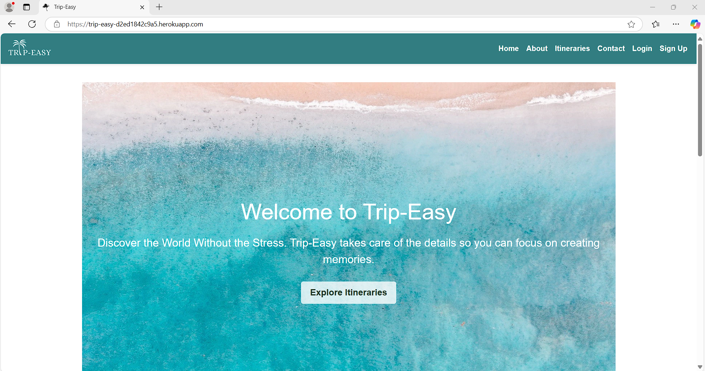

# Testing

Return back to the [README.md](README.md) file.

## Code Validation

### HTML

I have used the recommended [HTML W3C Validator](https://validator.w3.org) to validate all of my HTML files.

| Page | Screenshot | Notes |
| --- | --- | --- |
| 404 |  | Pass: No Errors, 1 Warning : HTML is compliant, external JS script warning. |
| About |  | Pass: No Errors |
| Base/Home |  | Pass: No Errors |
| Booking Form |  | Pass: No Errors, 1 Warning : HTML is compliant, external JS script warning. |
| Cancel Booking Confirmation |  | Pass: No Errors, 1 Warning : HTML is compliant, external JS script warning. |
| Delete Review Confirmation |  | Pass: No Errors, 1 Warning : HTML is compliant, external JS script warning. |
| Logout Confirmation |  | Pass: No Errors, 1 Warning : HTML is compliant, external JS script warning. |
| Contact |  | Pass: No Errors |
| Review Edit |  | Pass: No Errors, 1 Warning : HTML is compliant, external JS script warning. |
| Itinerary Cards |  | Pass: No Errors |
| Itinerary Delete Confirmation |  | Pass: No Errors, 1 Warning : HTML is compliant, external JS script warning. |
| Itinerary Details |  | Pass: No Errors |
| Login |  | Pass: No Errors |
| Delete Profile Confirmation |  | Pass: No Errors, 1 Warning : HTML is compliant, external JS script warning. |
| Edit Profile |  | Pass: No Errors, 1 Warning : HTML is compliant, external JS script warning. |
| Profile |  | Pass: No Errors, 1 Warning : HTML is compliant, external JS script warning. |
| Sign Up |  | Pass: No Errors |

### CSS

I have used the recommended [CSS Jigsaw Validator](https://jigsaw.w3.org/css-validator) to validate all of my CSS files. Which passed with no errors.

### JavaScript

I have used the recommended [JShint Validator](https://jshint.com) to validate all of my JS files.

| File | Screenshot | Notes |
| --- | --- | --- |
| modal-handler.js |  | Pass: No Errors - 1 'Undefined' message as bootstrap link is in the base.html file. |

### Python

I have used the recommended [PEP8 CI Python Linter](https://pep8ci.herokuapp.com) to validate all of my Python files.

#### Validation For Trip-Easy App
| File | Screenshot | Notes |
| --- | --- | --- |
| asgi.py |  | Pass: No Errors |
| settings.py |  | Pass: No Errors |
| urls.py |  | Pass: No Errors |
| wsgi.py |  | Pass: No Errors |

#### Validation For Booking App
| File | Screenshot | Notes |
| --- | --- | --- |
| admin.py |  | Pass: No Errors |
| apps.py |  | Pass: No Errors |
| forms.py |  | Pass: No Errors |
| models.py |  | Pass: No Errors |
| urls.py |  | Pass: No Errors |
| views.py |  | Pass: No Errors |

## Browser Compatibility

I've tested my deployed project on multiple browsers to check for compatibility issues.

| Browser | Screenshot | Notes |
| --- | --- | --- |
| Chrome |  | Works as expected |
| Firefox |  | Works as expected |
| Edge |  | Works as expected |

## Responsiveness

I've tested my deployed project on multiple devices to check for responsiveness issues.

| Device | Screenshot | Notes |
| --- | --- | --- |
| Mobile (DevTools) |  | Works as expected |
| Tablet (DevTools) |  | Works as expected |
| Desktop |  | Works as expected |

## Lighthouse Audit

I've tested my deployed project using the Lighthouse Audit tool to check for any major issues.

### Booking App Templates - Mobile Testing
| Page | Size | Screenshot | Notes |
| --- | --- | --- | --- |
| Home | Mobile |  | Some minor performance warnings |
| About | Mobile |  | Some minor performance warnings |
| Itineraries | Mobile |  | Some minor performance warnings |
| Itinerary Detail | Mobile |  | Some minor performance warnings |
| Contact | Mobile |  | Some minor performance warnings |
| Profile | Mobile |  | Some minor performance warnings |
| Login | Mobile |  | Some minor performance warnings |
| Sign Up | Mobile |  | Some minor performance warnings |
| 404 | Mobile |  | Some minor performance warnings |

### Booking App Templates - Desktop Testing
| Page | Size | Screenshot | Notes |
| --- | --- | --- | --- |
| Home | Desktop |  | Some minor performance warnings |
| About | Desktop |  | Some minor performance warnings |
| Itineraries | Desktop |  | Some minor performance warnings) |
| Itinerary Detail | Desktop |  | Some minor performance warnings |
| Contact | Desktop |  | Some minor performance warnings |
| Profile | Desktop |  | Some minor performance warnings |
| Login | Desktop |  | Some minor performance warnings |
| Sign Up | Desktop |  | Some minor performance warnings |
| 404 | Desktop |  | Some minor performance warnings |

## Defensive Programming

Defensive programming was manually tested with the below user acceptance testing:

| Page | User Action | Expected Result | Pass/Fail | Comments |
| --- | --- | --- | --- | --- |
| Nav links | | | | |
| | Click on Logo | Redirection to Home page | Pass | |
| | Click on Home link in navbar | Redirection to Home page | Pass | |
| | Click on About link in navbar | Redirection to About page | Pass | |
| | Click on Itineraries link in navbar | Redirection to Itineraries page | Pass | |
| | Click on Contact link in navbar | Redirection to Contact page | Pass | |
| | Click on Profile link in navbar | Redirection to Profile page | Pass | |
| | Click on Login link in navbar | Redirection to Login page | Pass | |
| | Click on Sign Up link in navbar | Redirection to Sign Up page | Pass | |
| | Click on Log Out link in navbar | Log out and Redirection to Home page | Pass | |
| | Click on Social links in Footer | Redirection to corresponding social page | Pass | |
| Home page | | | | |
| | Click on Explore Itineraries button on hero image | Redirection to Itineraries page | Pass | |
| | Click on Featured Itineraries View Details button | Redirection to that itinerary's details page | Pass | |
| Itineraries page | | | | |
| | Click on any itinerary's View Details button | Redirection to that itinerary's details page | Pass | |
| Itinerary Details Page | | | | |
| | Click on Book Now button | Redirect to booking confirmation page | Pass | |
| | Click on back button | Redirect to reservation list page | Pass | |
| | Click on back button | Redirect to reservation list page | Pass | |
| | Click on back button | Redirect to reservation list page | Pass | |
| | Click on back button | Redirect to reservation list page | Pass | |
| Booking Confirmation Page | | | | |
| | Click on Confirm Booking button | Redirect to Profile confirmation page | Pass | |
| | Click on Cancel button | Redirect to itinerary page | Pass | |
| Contact Page | | | | |
| |  Enter name | Redirect to Contact Form | Pass | |
| |  Enter valid email address | Redirect to Contact Form | Pass | |
| | Enter message | Redirect to Contact Form | Pass | |
| | Click on Submit button | Redirect to Contact page | Pass | |
| | Click on Google Map | Navigates as it should | Pass | |
| Login Page | | | | |
| | Enter valid Username | Field will only accept registered users | Pass | |
| | Enter valid password | Field will only accept password format | Pass | |
| | Click on Log In button | Redirects user to Home Page | Pass |
| | Click on Sign Up button | Redirects user to Sign Up Page | Pass |
| Sign Up Page | | | | |
| | Enter valid Username | Field will only accept username format | Pass | |
| | Enter valid password (twice) | Field will only accept password format | Pass | |
| | Click Register button | Redirects user to home page | Pass | |
| Log Out Page | | | | |
| | Click Logout button | Logs out user, Redirects user to Home page | Pass |
| | Click Cancel button | Keeps user logged in, redirects to Home page | Pass |
| Profile Page | | | | |
| | Click on the Edit Profile button | Redirects to Edit Profile page | Pass | |
| | Click on the Delete Account button | Redirects to Delete Account Confirmation page | Pass | |
| | Click on the Cancel booking button | Redirects to Delete Booking Confirmation page | Pass | |
| Edit Profile Page | | | | |
| | Enter user details | Field will only accept email format | Pass | |
| | Click on the Save Changes button | Redirects to Profile page | Pass | |
| | Click on the Cancel button | Redirects to Profile page | Pass | |
| Delete Account Confirmation Page | | | | |
| | Click on the Delete My Account button | Deletes account and redirects to Home page | Pass | |
| | Click on the Cancel button | Redirects to Profile page without deleting account | Pass | |
| Delete Booking Confirmation Page | | | | |
| | Click on the Yes, Cancel button | Deletes booking and redirects to Profile page | Pass | |
| | Click on the No, Go Back button | Keeps booking and redirects to Profile page | Pass | |
| | Click on the Cancel booking button | Redirects to Delete Booking Confirmation page | Pass | |
| Site Navigations - Logged Out User | | | | |
| | Navigate to any login required URL | Give option to Login or Sign Up | Pass | |

## User Story Testing

| User Story | Screenshot |
| --- | --- |
| As a user I want to log into my account so that I can access my saved trips and profile settings. |  |
|As a user I want to recover my account if I forget my password, so that I can regain access without creating a new account. |  |
| As a user I want to sign up for an account so that I can access the website's features. |  |
| As a user I want to log out of my account so that my session is securely ended. |  |
| As a user I want to book a trip from the itinerary page so that I can reserve my spot. |  |
| As a user I want to update my account information so that I can keep my details accurate. |  |
| As an admin I want to create, update, or delete itineraries, so that I can keep the trip offerings up-to-date. |  |
| As an admin I want to view and manage user bookings so that I can handle any issues or changes efficiently. |  |

## Bugs

- Navbar items wouldn't align on right.

    - To fix this, I had to remove css for header display:flex for them to align to the right.

- Raw html showing on homepage cards.

    

    - To fix this, I had to add 'safe' to base home.html

- Card buttons not staying at the bottom.

    

    - To fix this, I wrapped the card contents in a separate div and added css to the button : margin-top: auto;

- Logo not showing.

    

    - To fix this, I had to resize the logo image as the file size was too large.

- Footer not staying fixed to the bottom of the page on soame pages.

    

    - To fix this I had to set the .homepage height to 100vh.

- Extra zeros being displayed on prices.

    - To fix this, I had to add a float format so new code is: 
<strong>Price:</strong> £{{ itinerary.price|floatformat:"0" }}pp
 anywhere there was a price.

- Too many itineraries showing in the features section.

    - To fix this, I had to add 'slice' to  in the home.html file so that it will now only display 6.

## Unfixed Bugs

There are no remaining bugs that I am aware of.